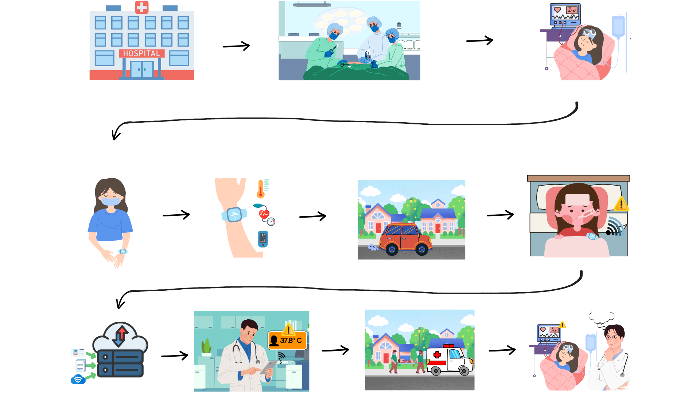
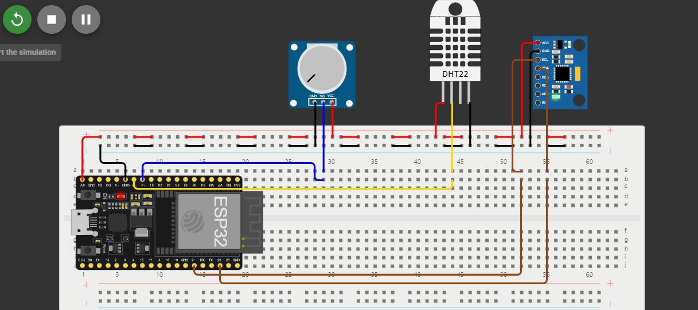
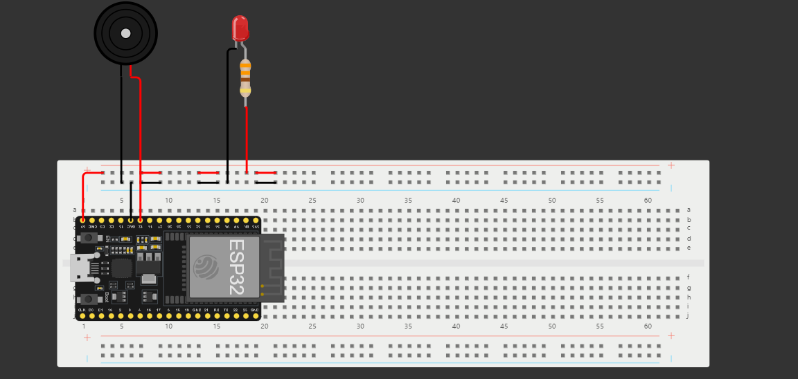

# Maloca das iCoisas - Hands On Intermediário

[Link](https://github.com/ed-henrique/maloca-das-icoisas-intermediario)

Projeto realizado no curso Maloca das iCoisas, módulo intermediário, pelo grupo 4 - Os Suricatos Cibernéticos.

## Big Picture

### Storytelling

### Situação Hipotética
1. **Paciente faz cirurgia**: O paciente passa pelo procedimento cirúrgico e é encaminhado para a sala de recuperação, onde começa o monitoramento.  
2. **Paciente é monitorado no hospital**: Sensores de movimento, temperatura, pressão arterial e batimentos cardíacos são fixados no corpo do paciente e conectados ao sistema.  
3. **Monitoramento contínuo no hospital**: Os sensores enviam dados em tempo real para a base de dados, e alertas são gerados caso algum parâmetro saia do padrão.  
4. **Paciente recebe alta e vai para casa**: O paciente recebe um dispositivo portátil de monitoramento contínuo, que mantém o envio de dados para os médicos.  
5. **Paciente passa mal em casa**: O sistema detecta alterações nos sinais vitais (ex: febre alta, pressão baixa) e gera um alerta automático.  
6. **Médico recebe notificação e toma providências**: O profissional analisa os dados do paciente remotamente e decide as ações necessárias.  
7. **Ambulância resgata o paciente**: O médico aciona uma ambulância, que recebe as informações do paciente e se dirige até sua residência.  
8. **Paciente retorna ao hospital**: O paciente é readmitido no hospital, onde passa por nova avaliação médica detalhada.  
9. **Acompanhamento do histórico do paciente**: O médico acessa os dados coletados pelo dispositivo para auxiliar no diagnóstico e no tratamento.  
<!--
1. Pessoa doente vai para o hospital, é atendida e admitida na internação;
2. Médicos colocam sensores de temperatura fixos no corpo da paciente;
3. Sensor de temperatura é conectado a uma base de dados alimentada em tempo real;
4. Quando a temperatua do paciente for ≥ 37.8 ºC, o sistema emite um alerta para os profissionais envolvidos;
5. O sistema registra o histórico da temperatura do paciente na base de dados;
6. O profissional verifica condição do paciente após alertas.
-->

## Equipe

- **Product Owner**: Thaís Oliveira Almeida
- **Scrum Master**: Eduardo Henrique Freire Machado

### Equipe de Desenvolvimento

- Eduardo Henrique Freire Machado;
- Gabriel Peixoto Menezes da Costa;
- Natália Ribeiro de Almada;

## Esquema de Conexão

### Dispositivo do Paciente
 

### Dispositivo do Médico
 

### Requisitos

#### Hardware

- 2 ESP32;
- 1 Sensor DHT11;
- 1 Acelerômetro;
- 1 Potênciometro;
- 1 LED;
- 1 Buzzer;
- Protoboard e fios de conexão;

**OBS**: 1 ESP32, 1 DHT11 e 1 Acelerômetro fazem parte do [IoT DevKit da Robocore](https://www.robocore.net/lorawan/iot-devkit-lorawan?srsltid=AfmBOoqmLS_Qbi0Ax6Vxjbh_UVDjhF-bGfuASA7Hd9aNu3m6E26OUI9B).

#### Software

- Flask;
- Streamlit;
- Arduino IDE com as bibliotecas DHT, Adafruit MPU6050 e WiFi;

## Recursos

- [Big Picture](https://www.canva.com/design/DAGX9015E_Y/igNJWoiv6dB_DmXLwmla8g/edit?utm_content=DAGX9015E_Y&utm_campaign=designshare&utm_medium=link2&utm_source=sharebutton)
- [Kanban](https://trello.com/invite/b/679d35de0177ff09056da883/ATTI3be7de3ce601a0041a49b6e8a4244ee41225AD07/hands-on-maloca-intermediario)
- [Documento de Requisitos Funcionais](https://docs.google.com/document/d/18FyWn2tTpSczmW8oEnDkLV8qdwSyeqJxpqSKUApjo3s/edit?usp=sharing)
- [Documento de Definição de Pronto](./dod.pdf)
- [Simulações](https://wokwi.com/projects/422903318761921537)

<!--
- [Pitch](https://www.canva.com/design/DAGZ3R3MyE4/rqdrzCDqPH6dExHXgRsWZw/edit?utm_content=DAGZ3R3MyE4&utm_campaign=designshare&utm_medium=link2&utm_source=sharebutton)
- [Esquema de Conexão](https://wokwi.com/projects/417194889520795649)
- [Documento de Progresso](https://docs.google.com/document/d/1z1uJHj0xGks3xBqaYloMBIi3Pqf4hMfBDdSm-7swn1A/edit?tab=t.0)
-->
